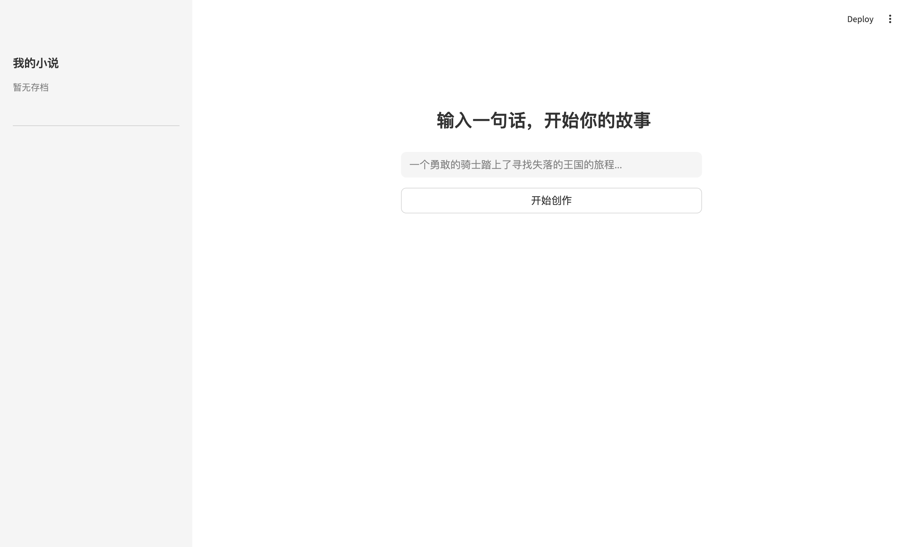
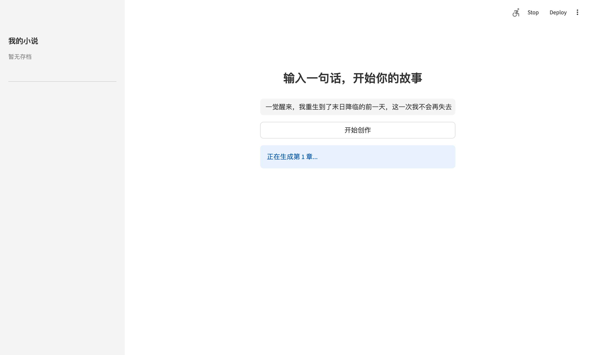
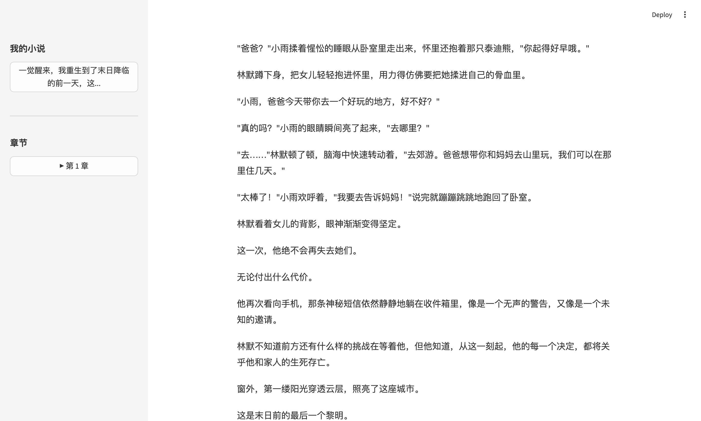
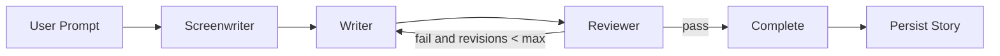

# LLM Fiction

一个基于 Streamlit 的多 Agent 小说生成应用。用户只需输入一句话，系统会通过 `Screenwriter -> Writer -> Reviewer` 的协作链路生成章节内容，并以本地 JSON 形式保存故事与阅读进度。

## 项目亮点

- 一句话开题，生成长篇小说的第 1 章并支持继续扩写。
- 基于 LangGraph 的多 Agent 编排，显式区分大纲、正文和审校职责。
- 采用 4 层 Story Bible 记忆结构，维持章节连续性与角色一致性。
- 提供简洁的 Streamlit 阅读界面，包含存档列表、章节导航与续写入口。
- 支持 OpenAI、Claude、DeepSeek，以及通过 OpenAI 兼容接口接入的模型服务。

## 界面预览

### 首页



### 生成中



### 阅读页



## 技术栈

- Python 3.11+
- Streamlit：单页应用 UI 与阅读界面
- LangGraph：多 Agent 状态图编排
- LangChain Core / LangChain OpenAI / Anthropic / DeepSeek：模型接入层
- Pydantic / pydantic-settings：状态模型与环境配置
- JSON File Storage：本地故事存档
- Pytest / Ruff：测试与静态检查
- uv：依赖锁定与环境管理

## Agent 框架设计

项目的生成链路定义在 `src/agents/graph.py` 和 `src/agents/nodes.py` 中，核心思路是把“写小说”拆成职责清晰的三个角色：

- `Screenwriter`：基于当前故事上下文先生成章节大纲。
- `Writer`：根据大纲和记忆上下文产出正文。
- `Reviewer`：检查人物一致性、剧情连贯性与文本质量。

当 `Reviewer` 判定失败时，状态机会把流程重新路由回 `Writer`，直到通过或达到最大修订次数。



### 状态管理

LangGraph 状态定义在 `src/agents/state.py`，包含：

- 用户输入 `user_prompt`
- 共享记忆 `story_bible`
- 当前章节号 `current_chapter`
- 修订计数 `revision_count`
- 章节大纲、正文、审稿结果
- 最终产出的 `completed_chapter`

### 记忆架构

项目使用 4 层 Story Bible 维护上下文，定义在 `src/memory/models.py`：

- `L1 recent_chapters`：最近 2 章全文
- `L2 short_term_arc`：最近 5 章摘要
- `L3 long_term_macro`：长程主线概述
- `L4 characters`：角色注册表

这个设计的目的是在上下文长度受限时，仍然保留故事主线、近因和角色信息。

## 目录结构

```text
src/
  agents/        # LangGraph 状态图、节点与输出 schema
  memory/        # Story Bible、摘要压缩、上下文注入
  models/        # Novel / Chapter / Character 数据模型
  storage/       # JSON 文件存储
  ui/            # Streamlit 页面、侧边栏与样式
  app.py         # 应用入口
  config.py      # 环境配置
tests/           # 单元测试
docs/images/     # README 展示图片
```

## 运行方式

### 1. 安装依赖

```bash
uv sync
```

或使用现有虚拟环境：

```bash
source .venv/bin/activate
```

### 2. 配置环境变量

项目从根目录 `.env` 读取配置，常用字段如下：

```env
LLM_PROVIDER=openai
LLM_MODEL=glm-5
OPENAI_API_KEY=your-api-key
OPENAI_BASE_URL=https://open.bigmodel.cn/api/paas/v4/
CHAPTER_LENGTH=2000
DATA_DIR=data/stories
```

如果使用智谱等 OpenAI 兼容接口，保留 `LLM_PROVIDER=openai`，并设置 `OPENAI_BASE_URL` 即可。

### 3. 启动应用

```bash
./.venv/bin/streamlit run src/app.py --server.port 8501
```

启动后访问 `http://localhost:8501`。

## 存储设计

- 每个故事存储为 `data/stories/{story-id}.json`
- 文件中包含 `novel`、`chapters`、`characters` 和 `story_bible`
- 读取后可恢复阅读页和后续续写所需上下文

## 当前实现说明

- UI 已覆盖首页输入、生成状态、阅读页、章节侧边栏和故事存档列表。
- 多 Agent 主链路已接通，并增加了对 OpenAI 兼容模型服务的配置支持。
- 结构化输出针对兼容接口做了本地 JSON 解析兜底，减少模型返回 Markdown 时的失败率。

## 后续可扩展方向

- 增加故事初始化 Agent，使首章前先完成标题、角色和章节规划。
- 将 Story Bible 在每章生成后自动更新，而不是只做基础持久化。
- 为不同模型供应商增加更细的适配层和错误回退策略。
- 增加导出 EPUB / Markdown 的能力。
